# 🍽️ RestaurantOS — Multi-Outlet Profit & Loss Management Dashboard

> **Production-ready** restaurant management system with real-time order tracking, inventory, expenses, and P&L analytics — deployed on Kubernetes with full GitOps, observability, and CI/CD automation.

---

<div align="center">
  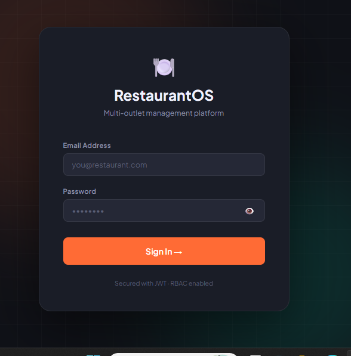
  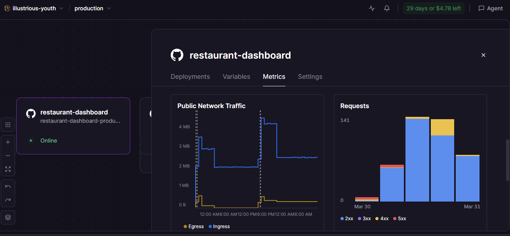
  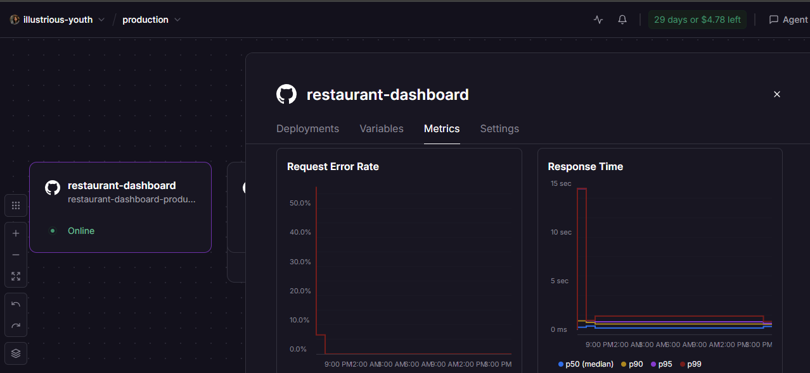
  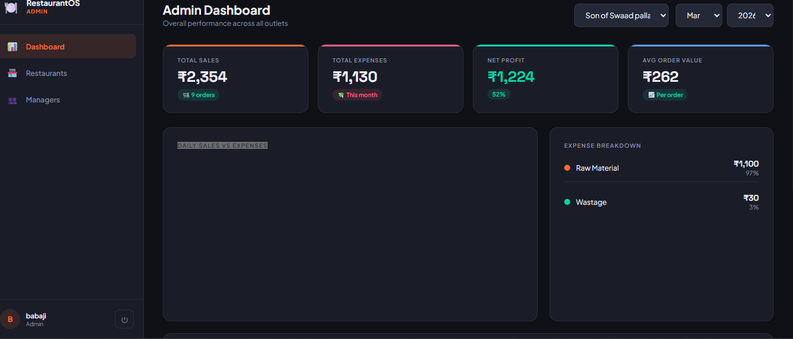
  <br/>
  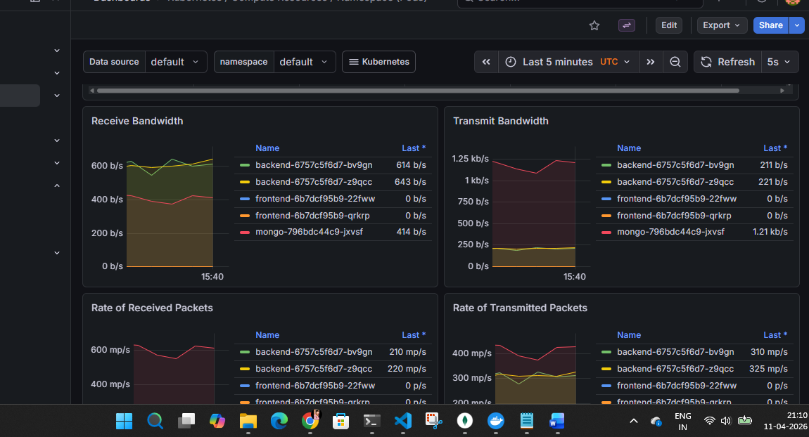
  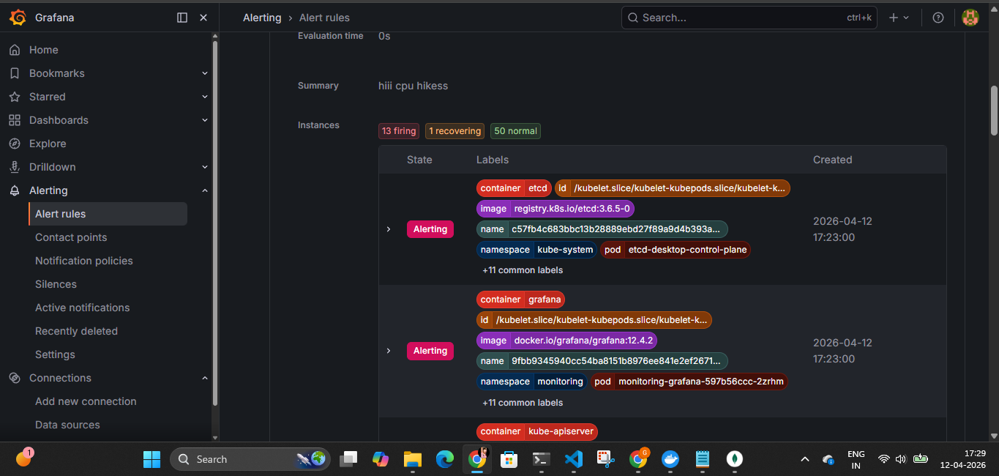
  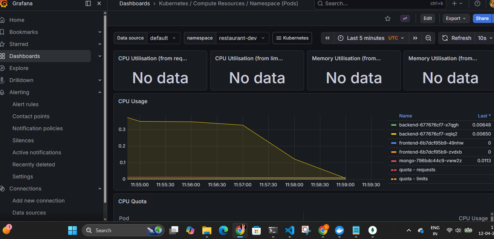
  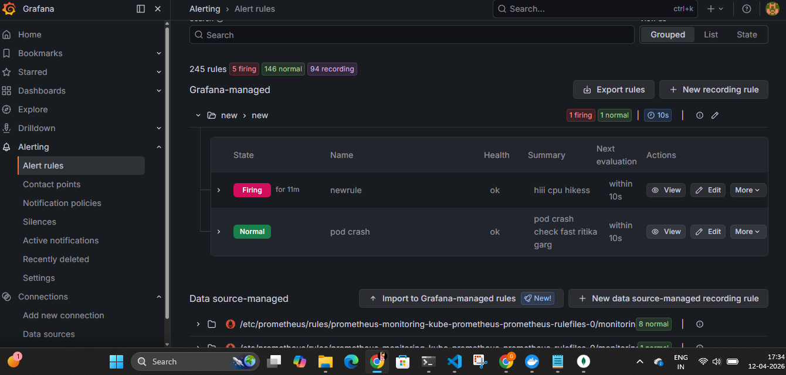
  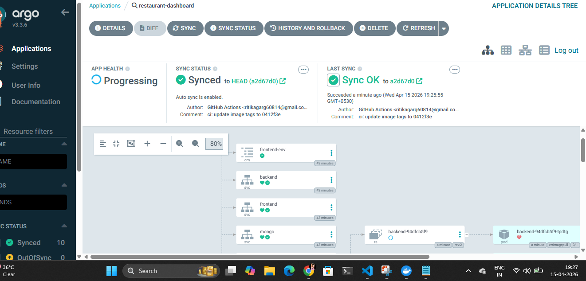
  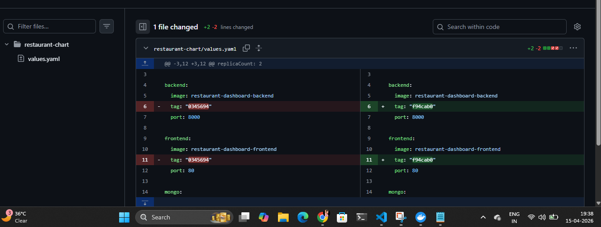
  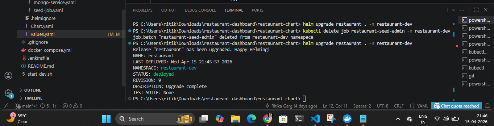
</div>

---

## 🛠️ DevOps & Infrastructure Stack

| Layer | Tool | Purpose |
|---|---|---|
| **Source Control** | GitHub | Code hosting, branch protection, PR reviews |
| **CI/CD Pipeline** | GitHub Actions | Automated build, test, Docker image push |
| **Containerization** | Docker | App packaging into portable images |
| **Package Manager** | Helm | Kubernetes app deployment as versioned charts |
| **GitOps Delivery** | ArgoCD | Auto-syncs K8s cluster with Git repo state |
| **Orchestration** | Kubernetes | Container scheduling, scaling, self-healing |
| **Metrics** | Prometheus | Time-series metrics scraping from all pods |
| **Dashboards** | Grafana | Real-time visualisation of app + infra metrics |

---

## 🔄 CI/CD Pipeline Flow

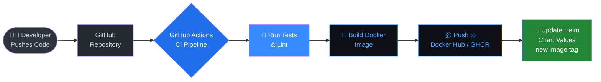

**What happens here:**
- Every `git push` to `main` triggers the GitHub Actions workflow automatically
- Tests run first — if they fail, the pipeline stops (no broken images shipped)
- Docker builds a production image and tags it with the commit SHA
- Helm chart `values.yaml` is updated with the new image tag, committing back to Git

---

## 🚀 GitOps Deployment Flow (ArgoCD)

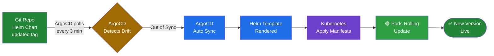

**What happens here:**
- ArgoCD continuously watches the Git repository (every ~3 minutes)
- When it detects the Helm chart has a new image tag → it marks the app as **Out of Sync**
- ArgoCD renders the Helm templates and applies them to the Kubernetes cluster automatically
- Kubernetes performs a **rolling update** — zero downtime deployment

---

## 📊 Monitoring & Observability Pipeline

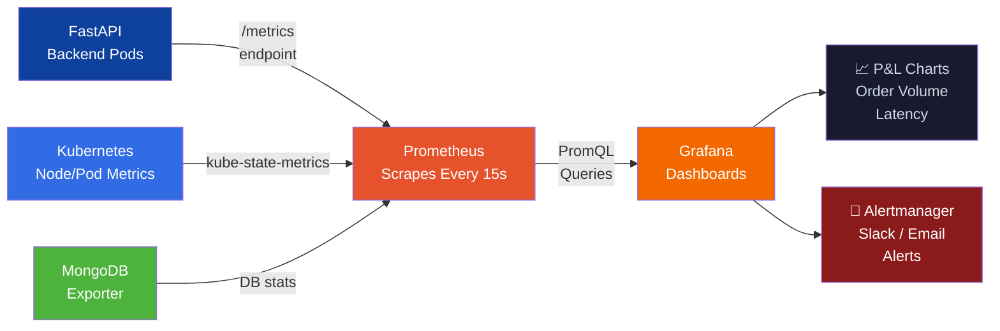

**What happens here:**
- FastAPI exposes a `/metrics` endpoint using `prometheus-fastapi-instrumentator`
- Prometheus scrapes metrics from all pods on a 15-second interval
- Grafana queries Prometheus using **PromQL** to build live dashboards
- Custom dashboards show: request rate, error rate, order revenue, active restaurants

---

## ☁️ Full System Architecture

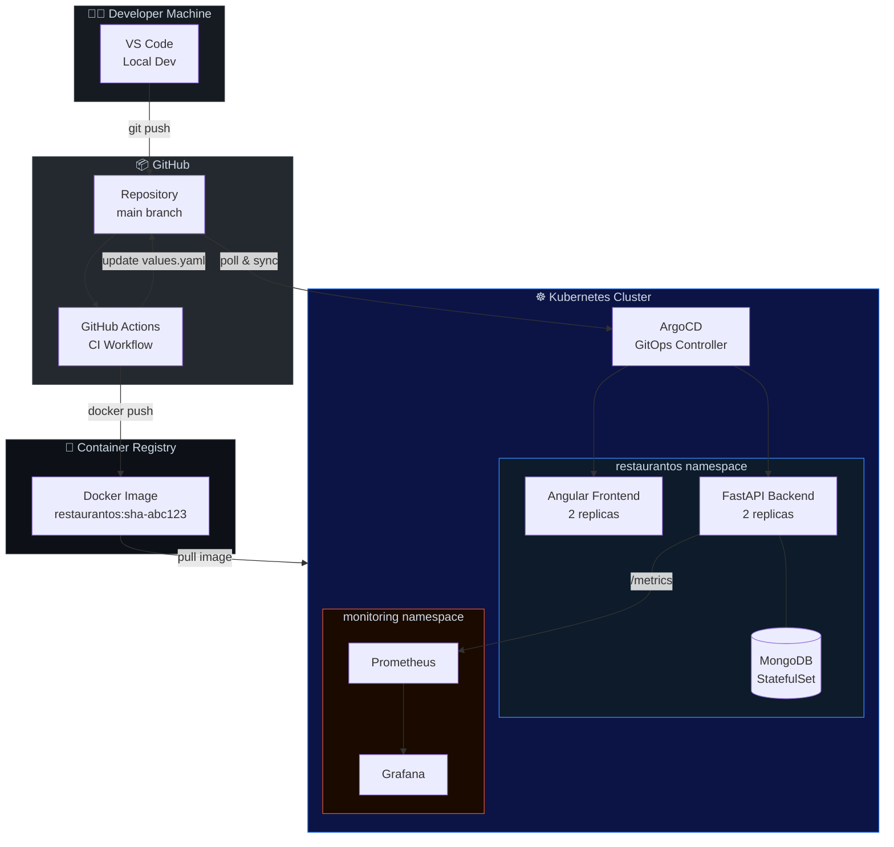

---

## 🔧 How Each Tool Is Used in This Project

### 🐙 GitHub Actions (CI)
The pipeline lives in `.github/workflows/deploy.yml`. On every push to `main`:
1. Checks out code and sets up Python + Node environments
2. Runs backend unit tests (`pytest`) and frontend build (`ng build`)
3. Builds a multi-stage Docker image (separate build & runtime layers for small image size)
4. Pushes the tagged image to the container registry
5. Patches `helm/values.yaml` with the new image tag and commits it back

### 🎯 ArgoCD (GitOps / CD)
ArgoCD is deployed inside the cluster and configured to watch this repo's `helm/` directory.
- **Application CRD** declares: source repo + target cluster + namespace
- When `values.yaml` changes (new image tag from CI), ArgoCD detects drift and **auto-syncs**
- Rollbacks are as simple as reverting a Git commit — cluster always matches Git state
- The ArgoCD UI shows real-time sync status, pod health, and deployment history

### ⚓ Helm (Kubernetes Package Manager)
All Kubernetes manifests are templated as a Helm chart under `helm/`:
```
helm/
├── Chart.yaml          # Chart metadata + version
├── values.yaml         # Environment-specific config (image tag, replicas, secrets ref)
└── templates/
    ├── deployment.yaml # FastAPI + Angular deployments
    ├── service.yaml    # ClusterIP + LoadBalancer services
    ├── ingress.yaml    # NGINX ingress rules
    ├── configmap.yaml  # Non-secret env vars
    └── hpa.yaml        # Horizontal Pod Autoscaler
```
Helm lets us deploy the same chart to `dev`, `staging`, and `prod` with different `values.yaml` — no copy-pasting manifests.

### 📊 Grafana + Prometheus (Observability)
Prometheus scrapes `/metrics` from the FastAPI app using this instrumentation:
```python
from prometheus_fastapi_instrumentator import Instrumentator
Instrumentator().instrument(app).expose(app)
```
Grafana dashboards (imported as JSON, version-controlled) show:
- **Business metrics**: orders per hour, revenue trend, top-selling items
- **App metrics**: API latency (p50/p95/p99), error rate, active connections
- **Infra metrics**: pod CPU/memory, MongoDB connections, disk usage

---

## 🏗️ Application Architecture

```
restaurant-dashboard/
├── backend/                   # FastAPI + Motor (async MongoDB)
│   ├── app/
│   │   ├── api/v1/
│   │   │   ├── endpoints/     # auth, users, restaurants, orders, expenses, inventory
│   │   │   ├── deps.py        # JWT auth + RBAC guards
│   │   │   └── router.py
│   │   ├── core/
│   │   │   ├── config.py      # Pydantic settings
│   │   │   ├── database.py    # Motor async client
│   │   │   └── security.py    # JWT + bcrypt
│   │   ├── schemas/           # Pydantic request/response models
│   │   └── main.py            # FastAPI app
│   ├── seed_admin.py
│   └── requirements.txt
│
├── frontend/                  # Angular 17 standalone components
│   └── src/app/
│       ├── admin/             # Admin shell + dashboard + restaurants + users
│       ├── manager/           # Manager shell + dashboard + orders + inventory + expenses
│       └── shared/            # Login, sidebar, guards, services, models
│
├── helm/                      # Helm chart for Kubernetes deployment
│   ├── Chart.yaml
│   ├── values.yaml
│   └── templates/
│
├── .github/workflows/         # GitHub Actions CI/CD pipelines
│   └── deploy.yml
│
└── docker-compose.yml         # Local development stack
```

---

## ⚡ Quick Start (Local Dev)

### Prerequisites
- Python 3.10+
- Node.js 18+
- MongoDB running on `localhost:27017`

### Option 1 — One-command setup
```bash
chmod +x start-dev.sh
./start-dev.sh
```

### Option 2 — Docker Compose
```bash
docker-compose up --build
docker exec restaurant_backend python seed_admin.py
```

### Option 3 — Manual
```bash
# Terminal 1: Backend
cd backend
python -m venv venv && source venv/bin/activate
pip install -r requirements.txt
python seed_admin.py
uvicorn app.main:app --reload --port 8000

# Terminal 2: Frontend
cd frontend
npm install
npm start
```

---

## 🔐 Default Credentials

| Role    | Email                    | Password     |
|---------|--------------------------|--------------|
| Admin   | admin@restaurant.com     | Admin@12345  |

---

## 👥 RBAC — Role-Based Access Control

| Feature               | Admin | Manager |
|-----------------------|:-----:|:-------:|
| View all restaurants  | ✅    | ❌      |
| Create restaurants    | ✅    | ❌      |
| Create manager users  | ✅    | ❌      |
| Disable managers      | ✅    | ❌      |
| Assign managers       | ✅    | ❌      |
| View own restaurant   | ✅    | ✅      |
| Add orders            | ✅    | ✅      |
| Log inventory         | ✅    | ✅      |
| Log expenses          | ✅    | ✅      |
| View analytics        | ✅    | Own only|
| Self-register         | ❌    | ❌      |

**Managers cannot self-register.** Only admin can create manager accounts.

---

## 📡 API Endpoints

### Auth
| Method | Endpoint              | Description       |
|--------|-----------------------|-------------------|
| POST   | /api/v1/auth/login    | Login → JWT token |

### Users (Admin only)
| Method | Endpoint                         | Description    |
|--------|----------------------------------|----------------|
| GET    | /api/v1/users/                   | List managers  |
| POST   | /api/v1/users/                   | Create manager |
| PATCH  | /api/v1/users/{id}/toggle        | Enable/disable |
| GET    | /api/v1/users/me                 | Current user   |

### Orders
| Method | Endpoint                        | Description            |
|--------|---------------------------------|------------------------|
| POST   | /api/v1/orders/                 | Create order           |
| GET    | /api/v1/orders/                 | List orders w/ filters |
| GET    | /api/v1/orders/summary/daily    | Daily P&L summary      |
| GET    | /api/v1/orders/summary/monthly  | Monthly P&L + chart    |

### Expenses & Inventory
| Method | Endpoint                        | Description            |
|--------|---------------------------------|------------------------|
| POST   | /api/v1/expenses/               | Add expense            |
| GET    | /api/v1/expenses/               | List expenses          |
| POST   | /api/v1/inventory/              | Submit daily inventory |
| GET    | /api/v1/inventory/low-stock     | Low stock alerts       |

Full interactive docs: `http://localhost:8000/docs`

---

## 💾 MongoDB Collections

| Collection    | Purpose                  | Key Indexes              |
|---------------|--------------------------|--------------------------|
| `users`       | Admin + manager accounts | email (unique)           |
| `restaurants` | Outlet profiles          | manager_id               |
| `orders`      | Every individual order   | restaurant_id + created_at |
| `expenses`    | Daily expenses           | restaurant_id + date     |
| `inventory`   | Daily stock submissions  | restaurant_id + date     |

---

## 🔧 Environment Variables

```bash
cp backend/.env.example backend/.env
```

```env
MONGO_URI=mongodb://localhost:27017
MONGO_DB=restaurant_db
SECRET_KEY=your-super-secret-key
ALGORITHM=HS256
ACCESS_TOKEN_EXPIRE_MINUTES=480
ALLOWED_ORIGINS=http://localhost:4200
```

For GitHub Actions deployment, add these as **Repository Secrets** under `Settings → Secrets and variables → Actions`.

---

## 🌩️ AWS Production Architecture

```
Users → CloudFront → S3 (Angular)
                   → ALB → ECS Fargate (FastAPI) → DocumentDB / Atlas
                                                  → Secrets Manager
                         → Lambda (scheduled reports)
                         → SES (email notifications)
```

### Cost estimate (5 restaurants, 5–10 users)
| Service                        | Monthly (INR) |
|--------------------------------|---------------|
| ECS Fargate (0.25 vCPU, 512MB) | ~₹200         |
| MongoDB Atlas M0 (free tier)   | ₹0            |
| S3 + CloudFront                | ~₹50          |
| ALB                            | ~₹200         |
| Secrets Manager                | ~₹80          |
| SES (emails)                   | ~₹20          |
| **Total**                      | **~₹550–700** |

---

## 🔒 Security Features

- **JWT Bearer tokens** (HS256, configurable expiry)
- **Bcrypt password hashing** (cost factor 12)
- **Role guards** on all protected routes (frontend + backend)
- **No self-registration** — managers created only by admin
- **CORS** restricted to frontend origin
- **Input validation** via Pydantic v2

---

## 📋 Daily Workflow (Manager)

1. Login → `/manager/dashboard`
2. Customer arrives → `/manager/orders` → add items + payment mode → **Save**
3. Order auto-appears in P&L dashboard
4. End of day → `/manager/inventory` → fill opening/closing stock
5. Any expense → `/manager/expenses` → log immediately
6. Dashboard auto-calculates profit/loss

---

## 📞 Support

API docs available at `/docs` (Swagger UI) after starting the backend.
